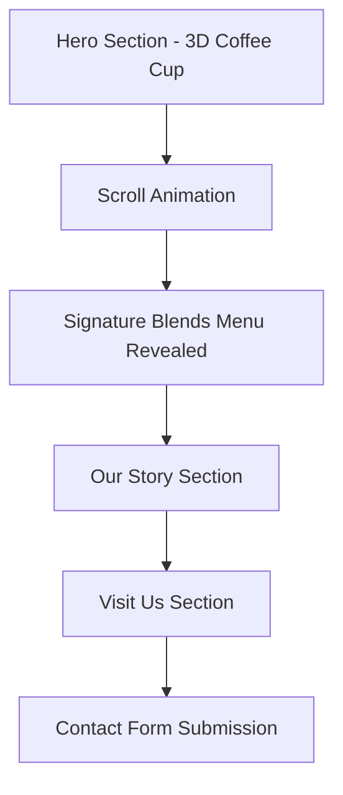

## 1. Product Overview

Velvet Brew is a luxury artisanal coffee cafe landing page featuring an immersive 3D experience. The product showcases premium coffee culture through sophisticated 3D interactions and elegant design.

The landing page targets coffee enthusiasts and luxury brand seekers, creating an memorable digital experience that reflects the premium quality of Velvet Brew's artisanal coffee offerings.

## 2. Core Features

### 2.1 User Roles

| Role | Registration Method | Core Permissions |
|------|---------------------|------------------|
| Website Visitor | No registration required | Browse all content, interact with 3D elements, submit contact form |

### 2.2 Feature Module

Our Velvet Brew landing page consists of the following main sections:
1. **Hero Section**: 3D rotating coffee cup with steam effects, brand introduction, scroll-triggered animations
2. **Our Story Section**: Brand narrative with cinematic text reveals and elegant typography
3. **Signature Blends Section**: Interactive beverage menu revealed through scroll animation
4. **Visit Us Section**: Contact information and form with location details

### 2.3 Page Details

| Page Name | Module Name | Feature description |
|-----------|-------------|---------------------|
| Hero Section | 3D Coffee Cup Display | Render high-quality 3D coffee cup with realistic materials and textures that rotates slowly 360 degrees continuously |
| Hero Section | Steam Animation | Emit realistic steam particles from coffee cup with physics-based movement and opacity fade |
| Hero Section | Scroll Animation | Smoothly transition 3D cup to side position revealing Signature Blends menu when user scrolls down |
| Hero Section | Parallax Background | Create floating coffee beans throughout background with subtle parallax movement responding to mouse position |
| Hero Section | Cinematic Text Reveal | Animate headline and subtext with elegant fade-in and slide effects triggered by scroll position |
| Our Story Section | Brand Narrative | Display compelling brand story with rich typography and smooth text animations |
| Our Story Section | Visual Elements | Incorporate warm, earthy visual elements that complement the luxury aesthetic |
| Signature Blends Section | Interactive Menu | Showcase premium coffee blends with hover effects and detailed descriptions |
| Signature Blends Section | Beverage Cards | Present coffee options in elegant card format with pricing and tasting notes |
| Visit Us Section | Contact Form | Provide form for visitor inquiries with validation and submission handling |
| Visit Us Section | Location Information | Display cafe address, hours, and contact details with map integration |

## 3. Core Process

**Visitor Journey Flow:**
1. User lands on page and sees 3D rotating coffee cup with steam effects
2. Background coffee beans float with subtle parallax movement
3. As user scrolls, cinematic text animations reveal brand messaging
4. 3D coffee cup smoothly transitions to side revealing Signature Blends menu
5. User can explore interactive beverage menu with hover effects
6. Visitor reads Our Story section with animated text reveals
7. User reaches Visit Us section to find location details and contact form

## 4. User Interface Design

### 4.1 Design Style
- **Primary Colors**: Deep chocolate brown (#3C2414), rich cream (#F5E6D3), warm gold (#D4AF37)
- **Secondary Colors**: Espresso brown (#2F1B14), latte beige (#E8D5B7), copper accents (#B87333)
- **Button Style**: Rounded corners with subtle shadows and gold hover effects
- **Typography**: Elegant serif fonts for headings, clean sans-serif for body text
- **Layout Style**: Full-screen immersive sections with smooth transitions
- **Icons**: Minimalist line icons with gold accents, coffee-themed emoji sparingly used

### 4.2 Page Design Overview

| Page Name | Module Name | UI Elements |
|-----------|-------------|-------------|
| Hero Section | 3D Coffee Cup | Center-positioned 3D model with realistic ceramic materials, gold rim details, proper lighting setup |
| Hero Section | Steam Effects | Semi-transparent particle system rising from cup with gentle sway motion |
| Hero Section | Background Beans | Scattered 3D coffee bean models with depth-based sizing and parallax response |
| Hero Section | Typography | Large serif headline "Velvet Brew" with elegant gold lettering, smooth fade-in animation |
| Signature Blends | Menu Cards | Cream-colored cards with brown text, gold borders, hover elevation effects |
| Our Story | Content Layout | Centered text blocks with generous line spacing, gold accent lines between paragraphs |
| Visit Us | Contact Form | Clean white form fields with brown borders, gold submit button with hover states |

### 4.3 Responsiveness
- **Desktop-First Design**: Optimized for 1920x1080 and larger displays
- **Mobile Adaptation**: Responsive breakpoints at 768px and 480px
- **Touch Interaction**: Optimized 3D interactions for mobile devices with touch-friendly controls
- **Performance**: Progressive enhancement with fallback 2D versions for lower-end devices

### 4.4 3D Scene Guidance

**Environment Setup:**
- **HDRI/Environment**: Warm studio lighting with soft shadows, cozy indoor cafe atmosphere
- **Lighting**: Three-point lighting setup - warm key light (golden tone), soft fill light (cream tone), subtle rim light for cup definition
- **Camera**: Initial position centered on coffee cup, 45-degree angle, smooth scroll-triggered transitions

**3D Assets:**
- **Coffee Cup**: High-poly ceramic model with subsurface scattering for realistic material
- **Coffee Beans**: Detailed texture maps with normal maps for surface detail
- **Steam Particles**: Alpha-mapped sprite system with turbulence and fade effects

**Interactions:**
- **Mouse Parallax**: Background elements respond to mouse movement with depth-based movement
- **Scroll Triggers**: Smooth animations tied to scroll position with easing functions
- **Hover Effects**: Subtle scale and glow effects on interactive elements

**Performance:**
- **Polygon Budget**: Coffee cup under 10,000 triangles, beans under 500 triangles each
- **Texture Resolution**: 2K textures for main elements, 512px for background elements
- **Frame Rate**: Target 60fps with automatic quality scaling for performance