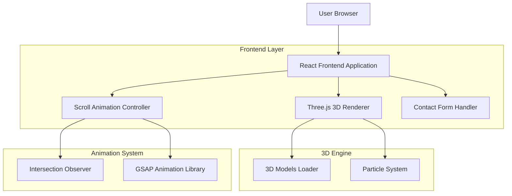

## 1. Architecture design



## 2. Technology Description

* **Frontend**: React\@18 + Three.js\@0.158 + @react-three/fiber\@8.15 + @react-three/drei\@9.88

* **Initialization Tool**: vite-init

* **Styling**: tailwindcss\@3 + styled-components\@6

* **Animation**: gsap\@3.12 + framer-motion\@10.16

* **3D Assets**: GLTF/GLB format with texture compression

* **Backend**: None (static landing page)

* **Deployment**: Vercel/Netlify ready

## 3. Route definitions

| Route    | Purpose                                                                           |
| -------- | --------------------------------------------------------------------------------- |
| /        | Main landing page with all sections (Hero, Our Story, Signature Blends, Visit Us) |
| /#hero   | Hero section anchor with 3D coffee cup display                                    |
| /#story  | Our Story section with brand narrative                                            |
| /#blends | Signature Blends menu section                                                     |
| /#visit  | Visit Us contact section                                                          |

## 4. Component Architecture

### 4.1 Core React Components

**Hero3D Component**

```typescript
interface Hero3DProps {
  scrollProgress: number;
  mousePosition: { x: number; y: number };
}
```

**CoffeeCup3D Component**

```typescript
interface CoffeeCup3DProps {
  rotationSpeed: number;
  steamIntensity: number;
  position: [number, number, number];
}
```

**ScrollAnimation Controller**

```typescript
interface ScrollAnimationProps {
  children: React.ReactNode;
  animationType: 'fadeIn' | 'slideUp' | 'parallax';
  triggerOffset: number;
}
```

### 4.2 3D Scene Management

**Scene Configuration**

```typescript
interface SceneConfig {
  camera: {
    position: [number, number, number];
    fov: number;
    near: number;
    far: number;
  };
  lighting: {
    ambient: { intensity: number; color: string };
    directional: { intensity: number; position: [number, number, number] };
    point: { intensity: number; position: [number, number, number] };
  };
  environment: {
    preset: 'studio' | 'sunset' | 'dawn';
    background: boolean;
  };
}
```

## 5. Performance Optimization

### 5.1 3D Asset Optimization

* **Model Complexity**: Coffee cup model optimized to 8,000 triangles

* **Texture Compression**: Basis Universal format for 70% size reduction

* **LOD System**: Three levels of detail for coffee beans based on distance

* **Instanced Rendering**: Batch render coffee beans for better performance

### 5.2 Animation Performance

* **Intersection Observer**: Efficient scroll detection with throttling

* **RAF Optimization**: RequestAnimationFrame management for smooth 60fps

* **Memory Management**: Proper cleanup of Three.js geometries and materials

* **Progressive Enhancement**: Fallback to 2D animations on low-end devices

## 6. Browser Compatibility

### 6.1 Supported Browsers

* Chrome 90+ (WebGL 2.0 support)

* Firefox 88+ (WebGL 2.0 support)

* Safari 14+ (WebGL 1.0 fallback)

* Edge 90+ (WebGL 2.0 support)

### 6.2 Fallback Strategy

* **WebGL Detection**: Automatic fallback to 2D animations if WebGL unavailable

* **Performance Monitoring**: Dynamic quality adjustment based on frame rate

* **Mobile Optimization**: Reduced particle count and simplified shaders for mobile

## 7. Build Configuration

### 7.1 Vite Configuration

```javascript
export default {
  optimizeDeps: {
    include: ['three', '@react-three/fiber', '@react-three/drei']
  },
  build: {
    rollupOptions: {
      output: {
        manualChunks: {
          'three-vendor': ['three', '@react-three/fiber'],
          'animation-vendor': ['gsap', 'framer-motion']
        }
      }
    }
  }
}
```

### 7.2 Asset Pipeline

* **GLTF Processing**: Automated optimization pipeline for 3D models

* **Texture Optimization**: WebP format with fallbacks to JPEG

* **Font Loading**: Preload critical fonts for smooth text animations

* **Critical CSS**: Inline critical styles for faster initial render

## 8. Deployment Considerations

### 8.1 Static Hosting

* **CDN Integration**: Global asset distribution for 3D models and textures

* **Caching Strategy**: Long-term caching for static assets with cache busting

* **Compression**: Brotli compression for all text-based assets

* **HTTPS**: SSL certificate required for WebGL security

### 8.2 Performance Monitoring

* **Core Web Vitals**: Monitor LCP, FID, and CLS metrics

* **3D Performance**: Track frame rate and memory usage

* **Error Tracking**: Capture WebGL errors and fallback triggers

* **User Analytics**: Monitor scroll interactions and 3D engagement

